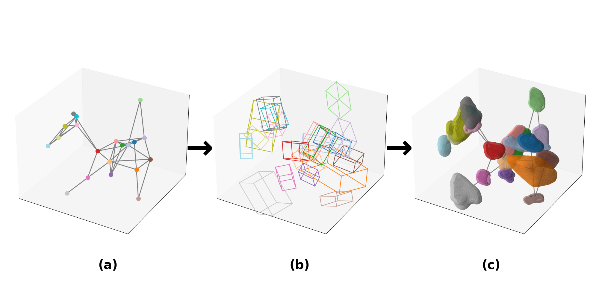
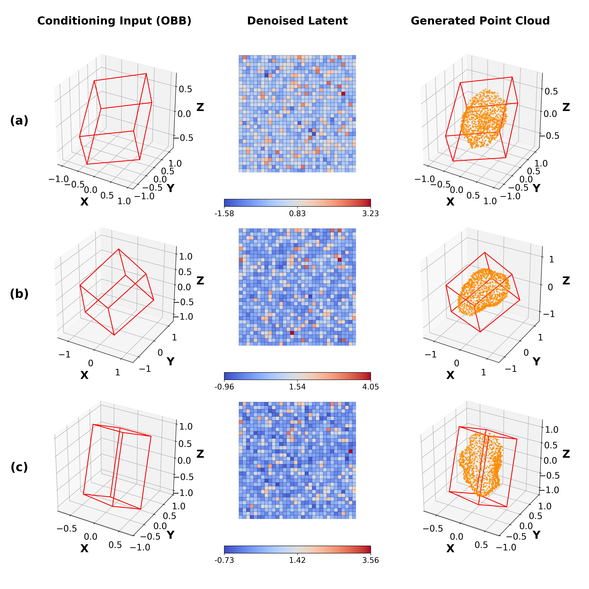
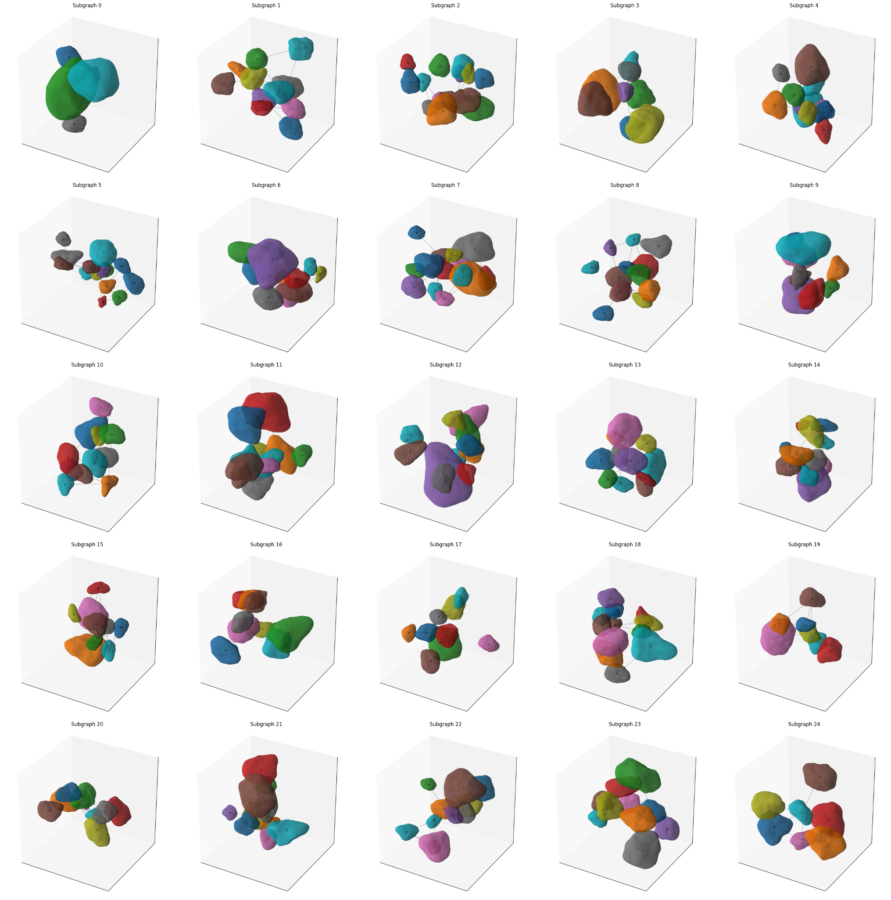
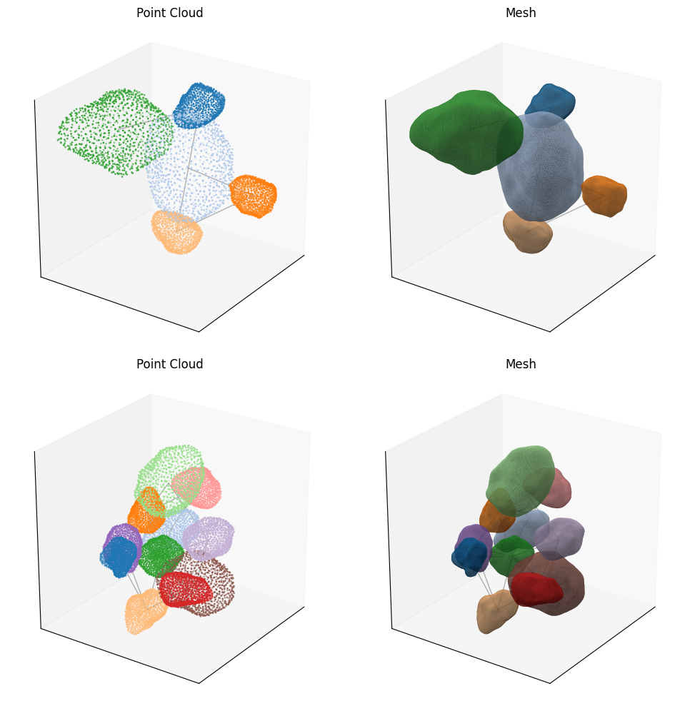

# Deep Generative Graphs for Topology-Preserved Synthetic PBX Microstructures

This repository accompanies the manuscript:

**Poliner, J., Sun, W., Alshibli, K. A., & Regueiro, R. A. (2026)**
*Deep Generative Graphs for Synthesizing Microstructure of Topology-Preserved Polymer-Bonded Explosives*
Engineering with Computers.

This repository currently provides the **synthetic dataset** described in the manuscript.
The cleaned and documented training and inference codebase will be released in a subsequent update.

---

## Overview

We introduce a hierarchical generative framework for synthesizing statistically and topologically consistent three-dimensional polymer-bonded explosive (PBX) microstructures.

The generative process is decomposed into three coupled stages:

1. **Topological generation** via a modified autoregressive GraphRNN (MicrostructureRNN)
2. **Geometric generation** via oriented bounding box (OBB) conditioned latent diffusion
3. **Reconstruction and remeshing** to produce simulation-ready assemblies

This separation enables independent control of grain network topology and grain morphology while preserving statistical fidelity to micro-CT benchmark data.

---

## Generative Pipeline

<p align="center">
  
</p>

The workflow consists of:

* Autoregressive generation of node-weighted grain networks
* OBB-conditioned latent diffusion for grain geometry synthesis
* Point cloud decoding from latent representations
* Poisson surface reconstruction
* Remeshing and spatial assembly into simulation-ready subdomains

---

## OBB-Conditioned Latent Geometry Reconstruction

<p align="center">
  
</p>

Latent diffusion operates in a learned geometric embedding space conditioned on oriented bounding box parameters and size descriptors. Decoded point clouds are subsequently reconstructed into watertight triangle meshes.

---

## Dataset Structure

The repository contains **100 generated subgraph clusters**, stored under:

```
generated_subgraphs/
├── subgraph_000/
├── subgraph_001/
├── ...
├── subgraph_099/
```

Each `subgraph_xxx/` directory contains:

* Individual grain geometries in **STL format** (one file per grain)
* A full assembled subgraph representation (`assembly.stl`)
* Spatially aligned grain configurations

All geometries are watertight triangle meshes reconstructed from latent diffusion–generated point clouds.

### Generation Sequence Per Grain

Each grain geometry is produced through:

1. Graph-based topological generation
2. OBB-conditioned latent diffusion in latent space
3. Point cloud decoding
4. Poisson surface reconstruction
5. Remeshing to produce watertight crystal geometries

---

## Representative Generated Assemblies

<p align="center">
  
</p>

These assemblies preserve key geometric and topological measures relative to the reference IDOX micro-CT dataset, including:

* Grain size distribution (effective radius)
* OBB dimension and orientation distributions
* Surface mean curvature distribution
* Orientation tensor metrics (compactness, flakiness, elongation)
* Degree distribution
* Clustering coefficient
* Graph density
* Inter-grain spacing statistics
* Polymer-to-grain phase ratio

Minor compression of distribution tails may occur due to latent-space regularization effects.

---

## Reconstruction to Simulation-Ready Geometry

<p align="center">
  
</p>

Generated point clouds are reconstructed using Poisson surface reconstruction and remeshed to produce watertight crystal grain geometries suitable for:

* Finite element preprocessing
* Voxelization workflows
* Mesoscale mechanical simulation
* Parametric studies

---

## Latent Diffusion Behavior

<p align="center">
  
</p>

The animation illustrates latent-space interpolation during diffusion-based geometry generation, demonstrating smooth morphological transitions under OBB conditioning.

---

## GraphRNN Inference Structure

<p align="center">
  
</p>

For a higher-resolution schematic, see:

[GraphRNN Nodes At Inference Time (PDF)](assets/GraphRNN_Nodes_At_Inference_Time.png)

The sequence illustrates node-state updates and conditional edge sampling during autoregressive graph construction.

---

## Reproducibility and Data Conventions

* All geometries are provided in **STL (stereolithography) format**.
* Units are consistent across all subgraphs.
* Each grain mesh is watertight.
* Assemblies are spatially aligned and directly usable for simulation workflows.
* Coordinate frames are preserved across individual grains and assemblies.

The dataset is synthetic and generated using trained generative models described in the associated manuscript.

---

## Code Release

The full training and inference pipeline will be released in a subsequent update once the codebase has been cleaned, modularized, and documented.

The release will include:

* MicrostructureRNN training and inference modules
* Point cloud autoencoder
* Conditional latent diffusion implementation
* Conditioning modules
* Mesh reconstruction utilities
* Voxelization tools

---

## Intended Applications

The generated assemblies may be used for:

* Mesoscale mechanical simulation
* Synthetic database augmentation
* Sensitivity analysis of microstructural descriptors
* Surrogate model development
* Shock and ignition modeling in PBX systems

All geometries are synthetic and generated using trained generative models.

---

## Citation

If this dataset is used, please cite:

```bibtex
@article{poliner2026pbx,
  title={Deep Generative Graphs for Synthesizing Microstructure of Topology-Preserved Polymer-Bonded Explosives},
  author={Poliner, Jarett and Sun, WaiChing and Alshibli, Khalid A. and Regueiro, Richard A.},
  journal={Engineering with Computers},
  year={2026}
}
```

---

## Status

* Link to Synthetic dataset (100 subgraph clusters) included
* Remeshed crystal grain STL geometries included
* Code release forthcoming

